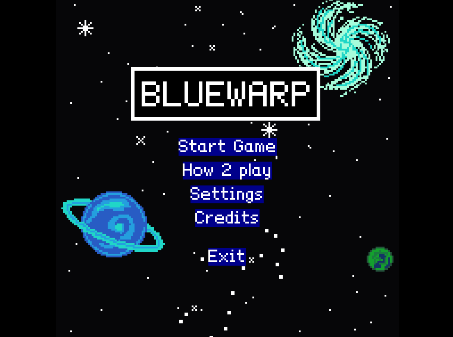
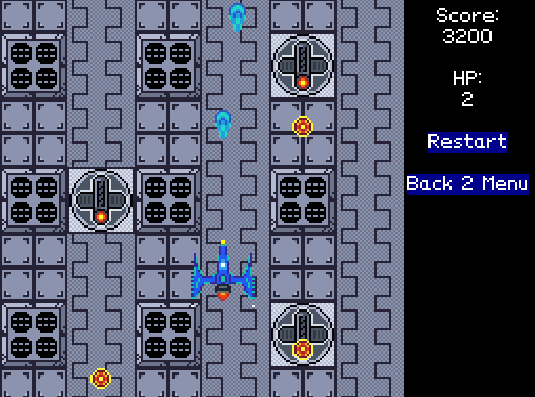

# Bluewarp
Bluewarp je zápočtový program pro předmět Programování 2 (NPRG031) ze LS 2024/25. Cílem bylo vytvořit vlastní verzi hry (ze ZX Spectrum), kde se současně pohybuje několik objektů.

- [Bluewarp](#bluewarp)
  - [Co je Bluewarp](#co-je-bluewarp)
    - [Cíl hry](#cíl-hry)
  - [Seznam funkcí hry](#seznam-funkcí-hry)
  - [Jak instalovat a hrát Bluewarp](#jak-instalovat-a-hrát-bluewarp)
  - [Ovládání](#ovládání)
  - [Snímky ze hry](#snímky-ze-hry)
    - [Menu:](#menu)
    - [Gameplay:](#gameplay)
- [Návod k instalaci a spuštění hry Bluewarp ve Visual Studiu](#návod-k-instalaci-a-spuštění-hry-bluewarp-ve-visual-studiu)
  - [Seznam závislostí](#seznam-závislostí)
  - [Příprava MonoGame](#příprava-monogame)
  - [Krok 1: Naklonujte repozitáře](#krok-1-naklonujte-repozitáře)
  - [Krok 2: Otevření projektu ve Visual Studiu](#krok-2-otevření-projektu-ve-visual-studiu)
  - [Krok 3: Odstraň původní referenci a znovu ji přidat přes Visual studio](#krok-3-odstraň-původní-referenci-a-znovu-ji-přidat-přes-visual-studio)
    - [Krok 3 (alternativa): Přidání správné reference na Nez](#krok-3-alternativa-přidání-správné-reference-na-nez)
  - [Krok 4: Spuštění hry](#krok-4-spuštění-hry)
    - [Vyřešení Mark of the Web](#vyřešení-mark-of-the-web)
    - [Vyřešení problému s __mgcb__](#vyřešení-problému-s-mgcb)
- [Technické informace](#technické-informace)
  - [Důvod výběru frameworků](#důvod-výběru-frameworků)
  - [Programová struktura hry](#programová-struktura-hry)
    - [Audio](#audio)
    - [Camera](#camera)
    - [Components](#components)
    - [Constants](#constants)
    - [Content](#content)
    - [Interfaces](#interfaces)
    - [Observers](#observers)
    - [Projectile](#projectile)
    - [ProjectileShooters](#projectileshooters)
      - [Enemy](#enemy)
      - [Player](#player)
    - [Scenes](#scenes)
    - [UIs](#uis)
  - [Reprezentace vstupních dat](#reprezentace-vstupních-dat)
  - [Reprezentace výstupních dat](#reprezentace-výstupních-dat)
  - [Průběh práce](#průběh-práce)
  - [Co by se mohlo přidat](#co-by-se-mohlo-přidat)
- [Závěr](#závěr)
  - [Poděkování](#poděkování)
    - [Použité zvukové efekty](#použité-zvukové-efekty)


## Co je Bluewarp
Bluewarp je hra žánru [Shoot 'em up](https://cs.wikipedia.org/wiki/Shoot_%E2%80%99em_up). Hra je převážně inspirovaná hrou [Redshift](https://spectrumcomputing.co.uk/entry/34714/ZX-Spectrum/Redshift), která byla vytvořená pro 8bitový domácí počítač [Sinclair ZX Spectrum](https://cs.wikipedia.org/wiki/Sinclair_ZX_Spectrum). Bluewarp je založený na [MonoGame](https://monogame.net/) a využívá [Nez](https://github.com/prime31/Nez) pro jednodušší interakci s Monogame.

### Cíl hry
Pomocí vesmírné bojové lodi, se snažíte zničit co nejvíce nepřátel a získat co nejvyšší skóre. Jenže to nebude jen tak jednoduché, neboť se budete muset vyhýbat barikádě nepřátelských střel a nakonec zdolat hlavního nepřítele Magnuse.

## Seznam funkcí hry
- Grafické rozhraní kontrolované myší
- Animovaná bojová loď
- Odměňující exploze
- Skvělá hudba na pozadí
- Zvukové efekty ve stylu 8bit
- Uživatelsky nastavitelné vlastonosti hry:
    - velikost obrazovky
    - hlasitost hudby a zvukových efektů
    - složitost hry

## Jak instalovat a hrát Bluewarp
Bluewarp je podporován jen pro __Windows__.
1. Stáhněte si ZIP soubor
    - Soubor __bluewarp_winx64_v1.X.X__ naleznete ve složce __/SelfContainedRelease__ nebo na __Release stránce__ 
2. Rozbalte stažený ZIP soubor (pravým tlačítkem -> __Extrahovat vše...__ nebo pomocí programu jako 7-Zip)
3. Otevřete rozbalenou složku
4. V ní najděte __bluewarp.exe__ - to je spustitelný soubor hry
5. Spustěte tento soubor
    - Při prvním spuštění může systém Windows zobrazit varování, že spušťíte neznámou aplikaci. Pokud jste si ZIP soubor __stáhli z tohoto Git repozitáře__, je vše v pořádku - můžete pokračovat kliknutím na __Další informace -> Spustit stejně__.
6. Klikněte na __Start game__ a hra se spustí

## Ovládání
Vše je ovládáno myší, krom bojové lodi.
- Bojová loď:
    - WASD nebo šipkami - pohyb bojové lodi
    - Mezerník - střílení
- Zavření celé hry:
    - ESC 
    - myší na tlačítka __EXIT__ nebo křížek v pravé, horním rohu

## Snímky ze hry
### Menu:

### Gameplay:


# Návod k instalaci a spuštění hry Bluewarp ve Visual Studiu
Tento projekt využívá framework Nez, ale s vlastním forkem. Předpokládá se, že používáte [Visual studio 2022](https://visualstudio.microsoft.com/) nebo novější.

## Seznam závislostí
- Monogame 3.8
- Nez ([vlastní fork, jelikož nemá verze](https://github.com/PhPetr/Nez))

## Příprava MonoGame
Následujte oficiální dokumentaci MonoGame pro přípravu [vývoje na Windows](https://docs.monogame.net/articles/getting_started/1_setting_up_your_os_for_development_windows.html?tabs=android) a [vývoj ve Visual studiu](https://docs.monogame.net/articles/getting_started/2_choosing_your_ide_visual_studio.html).

## Krok 1: Naklonujte repozitáře
1. Stáhněte si nebo naklonujte repozitář s hrou Bluewarp
2. Stahněte si nebo naklonujte můj fork frameworku Nez
    - https://github.com/PhPetr/Nez

Doporučuji mít oba repozitáře ve vedlejších složkách, např:
```
/projekty
├── bluewarp
└── Nez
```

## Krok 2: Otevření projektu ve Visual Studiu
1. Otevřete Visual Studio
2. Klikněte na __Open a project or solution__ a otevřete soubor __bluewarp.csproj__ nebo __bluewarp.sln__ z repozitáře __bluewarp__
    - Pokud Visual Studio při otevření vypíše chybu o chybějícím souboru __Nez.MG38.csproj__, je potřeba opravit referenci podle následujícího kroku.

## Krok 3: Odstranění původní reference a zpětné přidání přes Visual studio
1. V __bluewarp.csproj__ odstraňte:
```
<ItemGroup>
    <ProjectReference Include="nějaká\nesprávná\cesta\Nez\Nez.Portable\Nez.MG38.csproj" />
</ItemGroup> 
```
Otevřete __bluewarp.csproj__ ve Visual studiu a ve Solution exploreru:

1. Klikněte pravým tlačítkem na __Nez.MG38(Not found)__ > __Remove__
2. Klikněte pravým tlačítkem na __Solution 'bluewarp'__ > __Add__ > __Existing project...__
    - Přidej __Nez.MG38.csproj__ ze složky __Nez.Portable__
3. Klikni pravým tlačítkem na __bluewarp__ > __Add__ > __Project Reference...__
    - Vyber __Nez.MG38__ ze seznamu > __OK__

[Původní návod pro integraci Nez](https://github.com/PhPetr/Nez?tab=readme-ov-file#setup)

### Krok 3 (alternativa): Přidání správné reference na Nez
V projektu __bluewarp__ je referencován soubor "__Nez.MG38.csproj__", ale výchozí cesta může být neplatná. Oprava:

1. Otevřete "__bluewarp.csproj__" v některém editoru
2. Najděte sekci: (kolem řádku 30)
```
<ItemGroup>
    <ProjectReference Include="nějaká\nesprávná\cesta\Nez\Nez.Portable\Nez.MG38.csproj" />
</ItemGroup> 
```
3. Nahraďte "Include=..." tak, aby směřoval na správnou cestu k tvému "__Nez.MG38.csproj__". Např:
```
<ProjectReference Include="..\..\Nez\Nez.Portable\Nez.MG38.csproj" />
```
4. Uložte a zavřete "bluewarp.csproj"

## Krok 4: Spuštění hry
Spustěte ve Visual Studio projekt __bluewarp__
- Spuštění se s největší pravděpodobností nezdaří a v Outputu bude:
    ```
    1>File C:\cesta\k\projektu\bluewarp-master\.config\dotnet-tools.json came from another computer and might be blocked to help protect this computer. For more information, including how to unblock, see https://aka.ms/motw
    ```
### Vyřešení Mark of the Web
1. Otevři kořenovou složku projektu __bluewarp__
2. Přejdi do složky __.config__
3. Najdi soubor __dotnet-tools.json__ a otevři jeho __Vlastnosti__
4. V dolní části v sekci __Zabezpečení__ zaškrtni __Odblokovat__ (pokud je dostupné)
5. Klikni __Použít__ > __OK__

Teď by se projekt __bluewarp__ měl spustit v pořádku.

### Vyřešení problému s __mgcb__
Pokud projekt nejde spustit a v outputu je chyba:
```
1>C:\Users\USERNAME\.nuget\packages\monogame.content.builder.task\3.8.4\build\MonoGame.Content.Builder.Task.targets(155,5): error MSB3073: The command ""dotnet" "mgcb" /quiet /@:"C:\cesta\k\projektu\bluewarp-master\Content\Content.mgcb" /platform:DesktopGL /outputDir:"C:/cesta/k/projektu/bluewarp-master/Content/bin/DesktopGL/Content" /intermediateDir:"C:/cesta/k/projektu/bluewarp-master/Content/obj/DesktopGL/net8.0/Content" /workingDir:"C:/cesta/k/projektu/bluewarp-master/Content/"" exited with code 1.
```

Vyřešení problému:

1. Spusť terminál v kořenové složce projektu
2. Spusťi tento příkaz:
```
dotnet tool restore
```
3. Vyčkej na dokončení příkazu

To by mělo vyřešit problém s __mgcb__

# Technické informace
## Důvod výběru frameworků
- MonoGame
    - Open-source a bezplatný
    - Multiplatformní podpora (i když jsem ji ještě nestihl vyzkoušet)
    - Kompatibilní z Microsoft XNA
    - Žádný editor, jen čistý kód
- Nez
    - Zjednodušuje práci s MonoGame
    - Entity-component architektura
    - Vestavěná správa scén
    - Vestavěný systém kolizí a fyziky
    - Podpora Tiled map
    - Jednoduchá práce s animacemi
    - Zjednodušená práce s GUI

Uvažoval jsem též na použitím Unity místo MonoGame, jenže jsem se nechtěl zdržovat grafickým editorem.

Též jsem uvažoval nad použitím čistého Monogame bez frameworku Nez, ale Nez mi velmi zjednodušil práci s kolizí a nemusel jsem manuálně řešit spoustu věcí zmíněných výše.

## Programová struktura hry
Jednotlivé třídy jsou zdokumentované přímo v kódu.

Hra je rozdělena do složek:

### Audio
- třídy na správu a kontrolu hudby na pozadí a zvukových efektů

### Camera
- třídy na kontrolu pohybu kamery

### Components
- užitečné komponenty, které lze přidat entitě

### Constants
- třídy s konstantami a proměnnými, které jsou přístupné v celém projektu

### Content
- herní assety/zdroje, jako Tile mapa, sprity apod.

### Interfaces
- rozhraní pro IDestructable a IHittable

### Observers
- pozorovatele rozhraní

### Projectile
- třídy na ovládání projektilů a detektor kolize s projektilem

### ProjectileShooters
- BaseProjectileShooter je abstraktní třída, ze které tvořím hráče a nepřátele
#### Enemy
- třídy obstarávající spawnování nepřítel
- MagnusPhaseHandler obstarává fáze bosse Magnuse
#### Player
- třída na tvorbu hráče a jeho kontrolu

### Scenes
- BaseScene, abstraktní třída, slouží jako podklad pro tvorbu dalších scén
- jednotlivé scény hry

### UIs
- BaseUIManager, abstraktní třída, slouží jako podklad pro rychlou tvorbu UI
- jednotlivé UI k stejnojmenným scénám

## Reprezentace vstupních dat
- Pozice myši relativní k hernímu oknu a klávesnice (popsáno [výše](#ovládání)).

## Reprezentace výstupních dat
- Výstup je grafické uživatelské rozhraní.

## Průběh práce
Práci na této hře jsem si většinou užíval. Jen začátek nebyl idealní, neboť jsem se musel učit dva nové frameworky, se kterými jsem nikdy nepracoval. Zprvu byla práce s Nez velmi obtížná, neboť nemá moc dobrou dokumentaci a na některých místech je nekonzistentí. Ale pak to bylo už jednodušší, jakmile jsem si zažil všechny potřebné věci pro tvorbu mé hry.

Velmi pomohlo to, že jsem si ještě před programováním pořádně rozvrhl práci, připravil si všechny assety a udělal checklist věcí co nezapomenout. Potom jsem jen programoval a nemusel skákat na jiné věci.

## Co by se mohlo přidat
Tato hra je daleko od perfektní, a tak je dost věcí co mohu přidat, ale čas pro tento projekt je konečný.
- Příběh hry - nestihl jsem vymyslet nějaký zajímavý příběh, který by prohloubil zážitek hry
- Štít bojové lodi - aby to bylo víc jako Redshift
- Pohyblivé nepřátele - zpestřili by hru

Toto je jen pár nápadů a mám jich ještě víc a další dostávám od mých přátelů, co zkouší mou hru.

# Závěr
Tvorba této hry, učení se nových frameworků a využívání nových technik jsem si velmi užil. Během zkouškového období sloužilo programování Bluewarpu, jako příjemná rekreace a oddechnutí mezi zkouškami. I přes příjemné pocity, bych ale příště nedělal zápočtový program během zkouškového. Preferoval bych klid léta, které by bylo ideální na programování.

## Poděkování
Ještě bych k závěru rád poděkoval mým kamarádům za podporu při vývoji mé hry a jejich pomoci při testování.

Velké poděkování patří obzvášť mému kamarádovi Jakubovi Juříkovi, který i přes své hektické dny dokázal najít čas složit pro Bluewarp skvělou hudbu do pozadí.

### Použité zvukové efekty
- retro shot blaster by JavierZumer -- https://freesound.org/s/257232/ -- License: Attribution 4.0
- Retro, Space Explosion Or Death Sound Effect.wav by LilMati -- https://freesound.org/s/515005/ -- License: Creative Commons 0
- 8-bit damage-impact-break sounds.wav by EVRetro -- https://freesound.org/s/519072/ -- License: Creative Commons 0